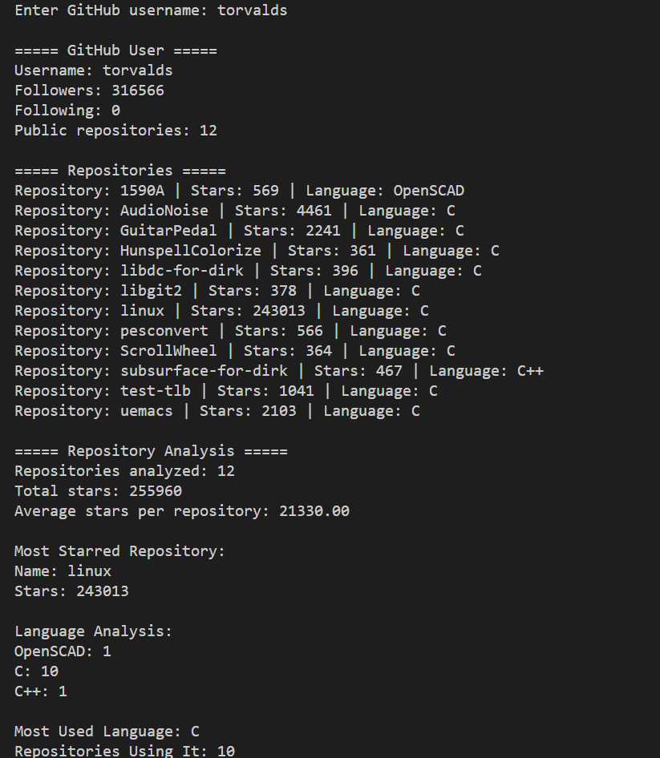
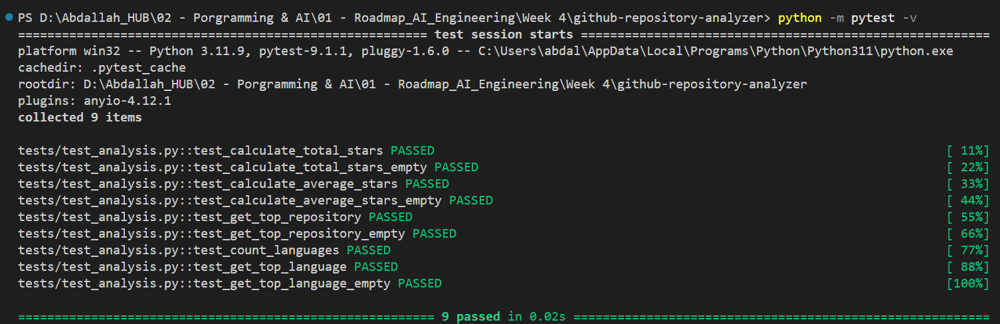

# GitHub Repository Analyzer

A Python command-line application that analyzes a public GitHub user and their repositories using the GitHub REST API.

## Project Goal

The goal of this project is to practice working with:

- HTTP requests
- REST APIs
- JSON data
- API authentication
- Environment variables
- Error handling
- Pagination
- Python modules and functions
- Logging
- Automated testing with pytest
- Git and GitHub

## Features

- Search for a GitHub user by username
- Display basic user information:
  - Username
  - Followers
  - Following
  - Number of public repositories
- Fetch all public repositories using pagination
- Display repository information:
  - Repository name
  - Star count
  - Primary programming language
- Analyze repositories:
  - Total stars
  - Average stars per repository
  - Most-starred repository
  - Programming language usage
  - Most-used programming language
- Handle:
  - Invalid usernames
  - Connection errors
  - Request timeouts
  - HTTP errors
  - Missing repository data
  - Users with no public repositories
- Store the GitHub API token securely using environment variables
- Log application errors
- Test analysis functions with pytest

## Project Structure

```text
github-repository-analyzer/
│
├── main.py
├── github_api.py
├── analysis.py
├── config.py
├── requirements.txt
│
├── tests/
│   └── test_analysis.py
│
├── images/
│   ├── analyzer-output.png
│   └── tests-passed.png
│
├── .env.example
├── .gitignore
└── README.md
```

## Installation

Clone the repository:

```bash
git clone https://github.com/abdallahsabbahdev/github-repository-analyzer.git
```

Move into the project directory:

```bash
cd github-repository-analyzer
```

Install the required packages:

```bash
python -m pip install -r requirements.txt
```

## Environment Variables

Create a `.env` file in the project root.

Add your GitHub personal access token:

```env
GITHUB_TOKEN=your_github_token_here
```

A template is already provided in:

```text
.env.example
```

The real `.env` file is ignored by Git and should never be committed.

## Usage

Run the application:

```bash
python main.py
```

Then enter a GitHub username:

```text
Enter GitHub username: torvalds
```

The application will fetch the user's public GitHub information and analyze their repositories.

## Example Output

```text
===== GitHub User =====
Username: example-user
Followers: 100
Following: 10
Public repositories: 8

===== Repositories =====
Repository: project-one | Stars: 20 | Language: Python
Repository: project-two | Stars: 10 | Language: JavaScript

===== Repository Analysis =====
Repositories analyzed: 8
Total stars: 50
Average stars per repository: 6.25

Most Starred Repository:
Name: project-one
Stars: 20

Language Analysis:
Python: 4
JavaScript: 2
C: 2

Most Used Language: Python
Repositories Using It: 4
```

## Screenshots

### Analyzer Output



### Pytest Results



## Tests

The project includes automated tests for the repository analysis functions.

Run the test suite with:

```bash
python -m pytest -v
```

Current test result:

```text
9 passed
```

The tests cover:

- Total star calculation
- Total stars with an empty repository list
- Average star calculation
- Average stars with an empty repository list
- Most-starred repository
- Empty repository handling
- Programming language counting
- Most-used programming language
- Empty language data

## Project Modules

### `main.py`

Controls the command-line application, displays results, and handles application-level errors.

### `github_api.py`

Communicates with the GitHub REST API and fetches user and repository data.

### `analysis.py`

Contains reusable functions for analyzing repository statistics.

### `config.py`

Loads configuration values and environment variables used by the application.

### `tests/test_analysis.py`

Contains automated pytest tests for the analysis functions.

## Error Handling

The application handles several common API and network problems, including:

- Invalid GitHub usernames
- Request timeouts
- Connection failures
- HTTP errors
- Missing configuration
- Users with no public repositories
- Missing language information

## Security

The GitHub API token is stored in a local `.env` file instead of being written directly in the source code.

The `.env` file is included in `.gitignore`, while `.env.example` shows which environment variable is required without exposing the real token.

## What I Learned

This project helped me practice building a Python application around a real external API instead of working only with local data.

I practiced:

- Sending authenticated HTTP requests
- Processing JSON API responses
- Working with multiple API endpoints
- Handling API pagination
- Separating a project into multiple modules
- Writing reusable functions
- Managing secrets with environment variables
- Handling network and HTTP errors
- Adding application logging
- Writing automated tests with pytest
- Using Git and GitHub to publish a complete project

## Future Improvements

Possible future improvements include:

- Sort repositories by stars
- Filter repositories by programming language
- Save analysis results to a file
- Compare multiple GitHub users
- Add more repository statistics
- Improve the command-line interface
- Add a graphical or web interface